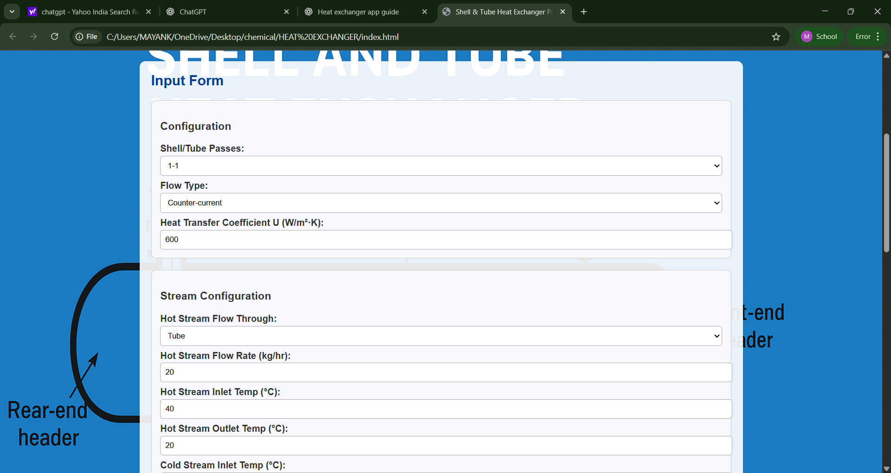

Author

Mayank Sahu
Undergraduate, IIT (ISM) Dhanbad
Chemical Engineering | Process Design Enthusiast

                                            ### 1. Heat Exchanger 
                                  

This project is a web-based application that provides a structured interface to document, configure, and analyze a Shell & Tube Heat Exchanger.

                                          How to use this program:

//                                    first step: download this repo;
//                            then fire the index.html the file in your brower;
//                        then a fill the form of the shell and tube heat exchanger;
//                                    the form then you recieve the data;
//              if you want to access the calculations and matlab code hit the calculation button on header;

                                                It allows users to:

//                                        View fluid property data (density, heat capacity, viscosity).
//                            Enter all design and operational parameters using a clean and user-friendly form.
//                    Specify configuration details like shell/tube passes, flow arrangement, and heat transfer coefficient.
//                                  Input hot and cold stream data, as well as tube and shell fluid properties.
//                                    Perform calculations or reset inputs easily using dedicated buttons.
//       The interface is designed using HTML + CSS + js and can be extended with JavaScript for calculations such as LMTD,                                             heat duty, and required heat exchanger area.

//                                                       warning 
//                        try not delete any file from the folder it may cause errors 

                                          ### 2. Filled Heat Exchanger Form
                                        

                                           ### 3. Calculation Results Page
                                       